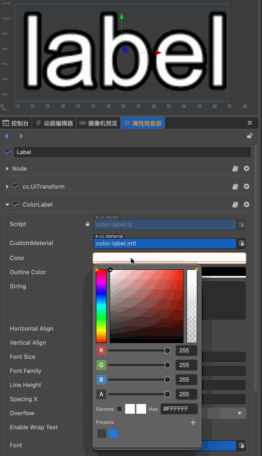
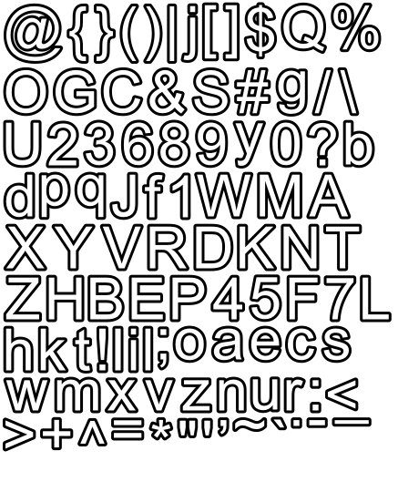
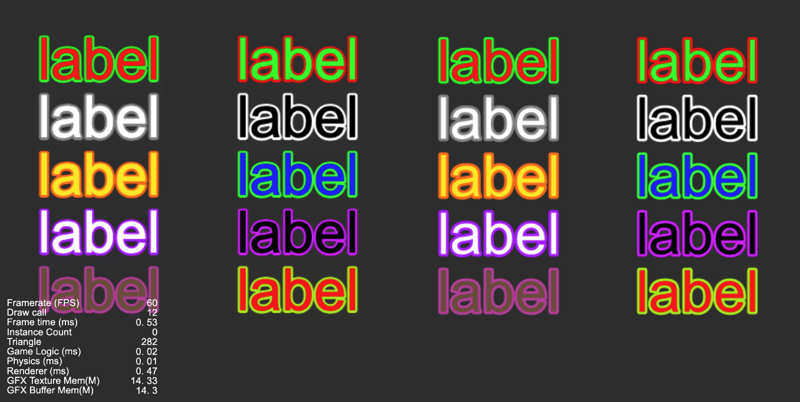

# BitmapFont 还能这么玩？

## 前言

BitmapFont 作为 Cocos 常用的性能优化手段之一, 大家想必都不陌生 (废话...), 随便找个工具导出个白色的字体, 美术想要什么颜色, 直接编辑器里面调整一下, OK 完美, 今天又是 UI 仔快乐的一天, 又过了一天, 美术同学拿着测试机急匆匆的跑过来, 指着屏幕跟你说: "这里, 颜色不太显..., 我要加描边", 你一想这不就加一套字体的事吗, 加, 想怎么加就怎么加, 坚决配合美术同学对美术表现的追求, 三年后..., 你望着示意图里标好的色号, 瞄了一眼字体目录里躺着的几十个花花绿绿的 BitmapFont, 绝望的打开了 [Glyph Designer](https://www.71squared.com/glyphdesigner)，或者直接使用了 LabelOutLine 组件, 就几个 DrawCall, 出个字体太不划算了...

直到有一天美术也看不下去了, 你们就不能只出一套字体, 可以分别调字体和描边的颜色吗? 就像这样



**而实现上面的效果, 只使用了一套字体, 白色黑描边( 只能用白色黑描边 )**



可以看下和正常 Label + LabelOutLine 的效果对比, 是不是根本分不清两边的区别, 12 个 DrawCall, 默认 Label 因为不能合批占了 10 个, profile 占了一个, 剩下使用 ColorLabel (下文介绍) 组件的 10 个 Label 共占用 1 个 DrawCall.



## 实现, 这里感兴趣的接着看, 不感兴趣的可以直接划到末尾白嫖了

### 着色器
着色器核心的代码只有一行, 修改的地方都有注释
```cpp
CCProgram sprite-vs %{
  precision highp float;
  #include <cc-global>
  #if USE_LOCAL
    #include <cc-local>
  #endif

  in vec3 a_position;
  in vec2 a_texCoord;
  in vec4 a_color;
  // 新增加一个顶点色, 相比 uniform 优点是可以合批
  in vec4 a_color2;

  out vec4 color;
  // 输出给片元着色器使用
  out vec4 color2;
  out vec2 uv0;

  vec4 vert () {
    vec4 pos = vec4(a_position, 1);

    #if USE_LOCAL
      pos = cc_matWorld * pos;
    #endif

    #if USE_PIXEL_ALIGNMENT
      pos = cc_matView * pos;
      pos.xyz = floor(pos.xyz);
      pos = cc_matProj * pos;
    #else
      pos = cc_matViewProj * pos;
    #endif

    uv0 = a_texCoord;
    color = a_color;
    // 赋值
    color2 = a_color2;

    return pos;
  }
}%

CCProgram sprite-fs %{
  precision highp float;
  #include <embedded-alpha>
  #include <alpha-test>

  in vec4 color;
  // 接收顶点着色器传过来的描边颜色
  in vec4 color2;

  #if USE_TEXTURE
    in vec2 uv0;
    #pragma builtin(local)
    layout(set = 2, binding = 11) uniform sampler2D cc_spriteTexture;
  #endif

  vec4 frag () {
    vec4 o = vec4(1, 1, 1, 1);

    #if USE_TEXTURE
      o *= CCSampleWithAlphaSeparated(cc_spriteTexture, uv0);
      #if IS_GRAY
        float gray  = 0.2126 * o.r + 0.7152 * o.g + 0.0722 * o.b;
        o.r = o.g = o.b = gray;
      #endif
    #endif

    // 重点在这里
    // o * color 把原本白色的字体, 变成了设置的颜色
    // vec3(1, 1, 1) - vec3(o.rgb) 字体白色的地方此时为黑色, 原本黑色地方此时为白色, 相当于过滤出描边部分
    // 乘 color2, 刚好原图黑色描边地方颜色为 color2
    // 然后相加, 即为最终的颜色, vec4 最后的 0 ,是为了让透明度以默认顶点色透明度为准
    o = (o * color) + (vec4(vec3(1, 1, 1) - vec3(o.rgb), 0) * color2);
    ALPHA_TEST(o);
    return o;
  }
}%
```

## 组件
接下来就是组件部分的实现, 因为组件为了支持合批, 多传了一个顶点色给着色器, 所以组件重点就是怎么把这个颜色传给顶点着色器, 通过修改 Assembler 的方式实现, 组件代码如下

```ts
@ccclass('ColorLabel')
@menu('UI/ColorLabel')
export class ColorLabel extends Label {

    public static colorBmfont: IAssembler = null;

    @property({
        displayOrder: 2,
        tooltip: 'i18n:labelOutline.color',
        visible: function (this: ColorLabel) {
            return this.font instanceof BitmapFont;
        }
    })
    get outlineColor (): Readonly<Color> {
        return this._outlineColor;
    }
    set outlineColor (value) {
        if (this._outlineColor.equals(value)) {
            return;
        }
        this._outlineColor.set(value);
    }

    @property(Color)
    private _outlineColor: Color = Color.BLACK.clone();

    protected _flushAssembler() {
        let assembler = Label.Assembler.getAssembler(this);

        if (this.font instanceof BitmapFont) {
            // 当字体为 BitmapFont 时, 使用自定义的 Assembler
            assembler = ColorLabel.colorBmfont;
        }

        if (this._assembler !== assembler) {
            this.destroyRenderData();
            this._assembler = assembler;
        }

        if (!this._renderData) {
            if (this._assembler && this._assembler.createData) {
                this._renderData = this._assembler.createData(this);
                this._renderData!.material = this.material;
            }
        }
    }
}
```

Assembler 代码, 只贴了重要部分

```ts
// ColorLabel Assembler
const tempColor = new Color(255, 255, 255, 255);
const tempColor2 = new Color(255, 255, 255, 255);

if (ColorLabel.colorBmfont === null) {
    function copyAssembler(target: any, source: any) {
        // 拷贝 bmfassembler
    }

    const colorBmfont: IAssembler = {};
    // getAssembler 这里使用的比较 hack 的方式
    // 主要是想在默认 assembler 基础上修改, 不想拷贝一堆代码过来
    copyAssembler(colorBmfont, Label.Assembler.getAssembler({ font: new BitmapFont }));
    ColorLabel.colorBmfont = colorBmfont;

    // 覆盖这个方法, 创建具有两个顶点色的 renderData
    colorBmfont.createData = (comp: ColorLabel) => {
        return RenderData.add(UIVertexFormat.vfmtPosUvTwoColor);
    }

    colorBmfont.fillBuffers =  (comp: ColorLabel) => {
        const node = comp.node;
        tempColor.set(comp.color);
        // 填充描边颜色
        tempColor2.set(comp.outlineColor);
        tempColor.a = node._uiProps.opacity * 255;
        fillMeshVertices3D(node, comp.renderData!, tempColor, tempColor2);
    }

    const vec3_temp = new Vec3();
    const _worldMatrix = new Mat4();

    function fillMeshVertices3D (node: Node, renderData: RenderData, color: Color, color2: Color) {
        const chunk = renderData.chunk;
        const dataList = renderData.data;
        const vData = chunk.vb;
        const vertexCount = renderData.vertexCount;

        node.getWorldMatrix(_worldMatrix);

        let vertexOffset = 0;
        for (let i = 0; i < vertexCount; i++) {
            const vert = dataList[i];
            Vec3.set(vec3_temp, vert.x, vert.y, 0);
            Vec3.transformMat4(vec3_temp, vec3_temp, _worldMatrix);
            vData[vertexOffset++] = vec3_temp.x;
            vData[vertexOffset++] = vec3_temp.y;
            vData[vertexOffset++] = vec3_temp.z;
            // 引擎代码没有下面的两行, 应该是在别的地方做的, 我没找到, 没有这两行 UV 是错的
            vData[vertexOffset++] = vert.u;
            vData[vertexOffset++] = vert.v;
            // 设置顶点色
            Color.toArray(vData, color, vertexOffset);
            // 设置描边颜色
            Color.toArray(vData, color2, vertexOffset + 4);
            vertexOffset += 8;
        }
        // 略
    }
}
```

以上就是这个组件的全部了, 详细的可以访问 [GitHub ColorLabel](https://github.com/yanjifa/color-label) 查看示例工程, (虽然工程使用 3.5.0 制作, 理论上低版本也是可以用的)
